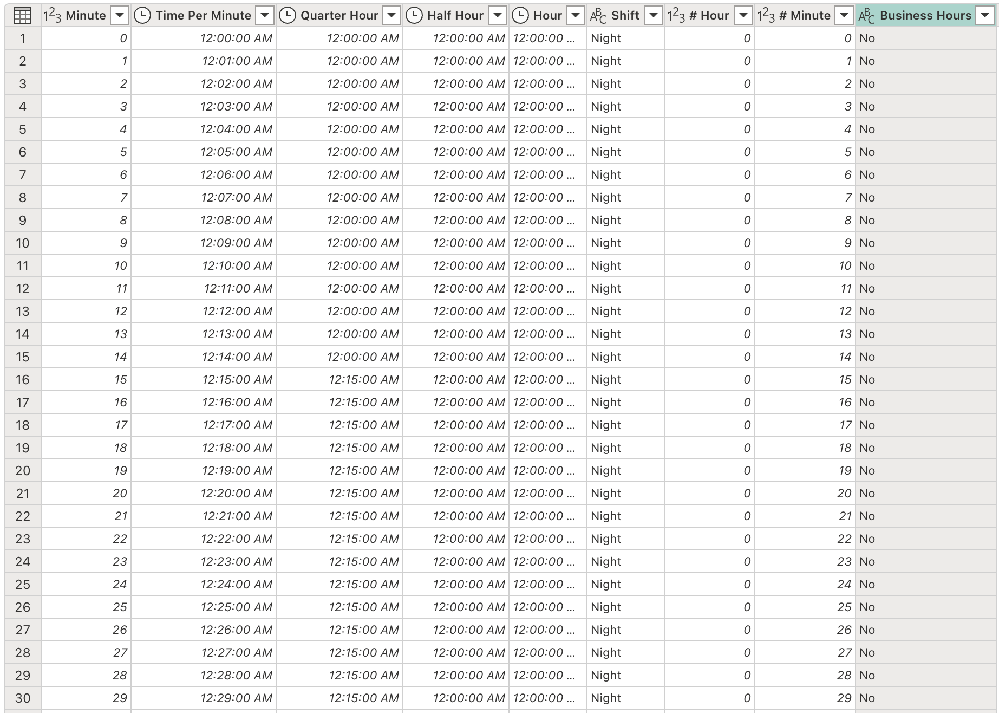

# Time Dimension Table in Power Query


## Overview
This repository contains a Power Query formula written in M language that generates a dataset of minute-by-minute breakdowns for a 24-hour period. The dataset includes categorizations such as time intervals (quarter-hour, half-hour, and hour), time groups, and shifts (morning, afternoon, night). The formula is useful for time-based data analysis and visualization.

&nbsp;

  

&nbsp;

## Case Studies
🕒 Scheduling Optimization: Group and analyze events by specific time blocks (e.g., quarter-hour, half-hour) to identify peak periods.

📈 Shift Analysis: Categorize time-based data into shifts (morning, afternoon, night) for workforce or operational planning.

🔄 Time Tracking: Define and assess working hours (e.g., commercial hours) for productivity analysis.


&nbsp;
## Code

This is the generic structure of the formula using placeholder terms for variables, tables, columns, metrics, and text:

**English** 🇬🇧
&nbsp;
```
let
    // Create a list of minutes in the day (from 0 to 1439)
    Source = {0..1439},

    // Convert the list into a table
    TableFromList = Table.FromList(Source, Splitter.SplitByNothing(), null, null, ExtraValues.Error),

    // Rename the column for clarity
    RenamedColumn = Table.RenameColumns(TableFromList, {{"Column1", "Minute"}}),

    // Change the type of the "Minute" column to integer
    ChangedTypeMinute = Table.TransformColumnTypes(RenamedColumn, {{"Minute", Int64.Type}}),

    // Add a column with the fraction of the day for each minute
    DivisionAdded = Table.AddColumn(ChangedTypeMinute, "Time Per Minute", each [Minute] / 1440, type number),

    // Change the type of "Time Per Minute" to time format
    ChangedTypeTime = Table.TransformColumnTypes(DivisionAdded, {{"Time Per Minute", type time}}),

    // Calculate the quarter-hour group
    QuarterHourGroup = Table.AddColumn(ChangedTypeTime, "Quarter Hour Group", each Number.IntegerDivide([Minute], 15), Int64.Type),

    // Calculate the half-hour group
    HalfHourGroup = Table.AddColumn(QuarterHourGroup, "Half Hour Group", each Number.IntegerDivide([Minute], 30), Int64.Type),

    // Calculate the hourly group
    HourGroup = Table.AddColumn(HalfHourGroup, "Hour Group", each Number.IntegerDivide([Minute], 60), Int64.Type),

    // Calculate the quarter hour in time format
    QuarterHourTime = Table.AddColumn(HourGroup, "Quarter Hour", each [Quarter Hour Group] * 15 / 1440),

    // Change the type of "Quarter Hour" to time format
    ChangedTypeQuarterHour = Table.TransformColumnTypes(QuarterHourTime, {{"Quarter Hour", type time}}),

    // Calculate the half-hour in time format
    HalfHourTime = Table.AddColumn(ChangedTypeQuarterHour, "Half Hour", each [Half Hour Group] * 30 / 1440),

    // Change the type of "Half Hour" to time format
    ChangedTypeHalfHour = Table.TransformColumnTypes(HalfHourTime, {{"Half Hour", type time}}),

    // Calculate the hour in time format
    HourTime = Table.AddColumn(ChangedTypeHalfHour, "Hour", each [Hour Group] * 60 / 1440),

    // Change the type of "Hour" to time format
    ChangedTypeHour = Table.TransformColumnTypes(HourTime, {{"Hour", type time}}),

    // Remove intermediate columns for the groups
    RemovedIntermediateColumns = Table.RemoveColumns(ChangedTypeHour, {"Quarter Hour Group", "Half Hour Group", "Hour Group"}),

    // Add a column to categorize shifts
    ShiftCategorization = Table.AddColumn(RemovedIntermediateColumns, "Shift", each if [Hour] >= #time(6,0,0) and [Hour] <= #time(12,0,0) then "Morning" else if [Hour] > #time(12,0,0) and [Hour] <= #time(18,30,0) then "Afternoon" else "Night", type text),

    // Extract the hour from the "Hour" column
    ExtractedHour = Table.AddColumn(ShiftCategorization, "# Hour", each Time.Hour([Hour]), Int64.Type),

    // Extract the minute from the "Time Per Minute" column
    ExtractedMinute = Table.AddColumn(ExtractedHour, "# Minute", each Time.Minute([Time Per Minute]), Int64.Type),

    // Add column to indicate if within business hours
    CommercialHours = Table.AddColumn(ExtractedMinute, "Business Hours", each if [Time Per Minute] >= #time(9,0,0) and [Time Per Minute] <= #time(18,0,0) then "Yes" else "No", type text)
in
    CommercialHours

```
&nbsp;


**Spanish** 🇪🇸
```
let
    // Crear una lista de minutos del día (de 0 a 1439)
    Origen = {0..1439},

    // Convertir la lista a una tabla
    TablaDesdeLista = Table.FromList(Origen, Splitter.SplitByNothing(), null, null, ExtraValues.Error),

    // Renombrar la columna para mayor claridad
    ColumnaRenombrada = Table.RenameColumns(TablaDesdeLista, {{"Column1", "Minuto"}}),

    // Cambiar el tipo de la columna "Minuto" a tipo entero
    TipoMinutoCambiado = Table.TransformColumnTypes(ColumnaRenombrada, {{"Minuto", Int64.Type}}),

    // Agregar una columna con la fracción del día para cada minuto
    DivisionAgregada = Table.AddColumn(TipoMinutoCambiado, "Hora por Minuto", each [Minuto] / 1440, type number),

    // Cambiar el tipo de "Hora por Minuto" a formato de hora
    TipoHoraCambiado = Table.TransformColumnTypes(DivisionAgregada, {{"Hora por Minuto", type time}}),

    // Calcular el grupo de cuartos de hora
    GrupoCuartoHora = Table.AddColumn(TipoHoraCambiado, "Grupo Cuarto de Hora", each Number.IntegerDivide([Minuto], 15), Int64.Type),

    // Calcular el grupo de media hora
    GrupoMediaHora = Table.AddColumn(GrupoCuartoHora, "Grupo Media Hora", each Number.IntegerDivide([Minuto], 30), Int64.Type),

    // Calcular el grupo de hora completa
    GrupoHora = Table.AddColumn(GrupoMediaHora, "Grupo Hora", each Number.IntegerDivide([Minuto], 60), Int64.Type),

    // Calcular el cuarto de hora en formato hora
    CuartoHoraTiempo = Table.AddColumn(GrupoHora, "Cuarto de Hora", each [Grupo Cuarto de Hora] * 15 / 1440),

    // Cambiar el tipo de "Cuarto de Hora" a formato de hora
    TipoCuartoHoraCambiado = Table.TransformColumnTypes(CuartoHoraTiempo, {{"Cuarto de Hora", type time}}),

    // Calcular la media hora en formato hora
    MediaHoraTiempo = Table.AddColumn(TipoCuartoHoraCambiado, "Media Hora", each [Grupo Media Hora] * 30 / 1440),

    // Cambiar el tipo de "Media Hora" a formato de hora
    TipoMediaHoraCambiado = Table.TransformColumnTypes(MediaHoraTiempo, {{"Media Hora", type time}}),

    // Calcular la hora en formato hora
    HoraTiempo = Table.AddColumn(TipoMediaHoraCambiado, "Hora", each [Grupo Hora] * 60 / 1440),

    // Cambiar el tipo de "Hora" a formato de hora
    TipoHoraCambiado = Table.TransformColumnTypes(HoraTiempo, {{"Hora", type time}}),

    // Eliminar las columnas intermedias de los grupos
    ColumnasIntermediasEliminadas = Table.RemoveColumns(TipoHoraCambiado, {"Grupo Cuarto de Hora", "Grupo Media Hora", "Grupo Hora"}),

    // Añadir una columna para categorizar los turnos
    CategorizacionTurno = Table.AddColumn(ColumnasIntermediasEliminadas, "Turno", each if [Hora] >= #time(6,0,0) and [Hora] <= #time(12,0,0) then "Mañana" else if [Hora] > #time(12,0,0) and [Hora] <= #time(18,30,0) then "Tarde" else "Noche", type text),

    // Extraer la hora de la columna "Hora"
    HoraExtraida = Table.AddColumn(CategorizacionTurno, "# Hora", each Time.Hour([Hora]), Int64.Type),

    // Extraer el minuto de la columna "Hora por Minuto"
    MinutoExtraido = Table.AddColumn(HoraExtraida, "# Minuto", each Time.Minute([Hora por Minuto]), Int64.Type),

    // Añadir columna para indicar si está dentro del horario comercial
    HorarioComercial = Table.AddColumn(MinutoExtraido, "Horario Comercial", each if [Hora por Minuto] >= #time(9,0,0) and [Hora por Minuto] <= #time(18,0,0) then "Sí" else "No", type text)
in
    HorarioComercial

```
&nbsp;
## Notes

**Time Interval Adjustment**:&nbsp;
Since this table operates at the minute level, for second-level analysis, you would need to adjust the granularity of the table.

&nbsp;

## Author 
[@jenmiraba](https://github.com/jenmiraba)


